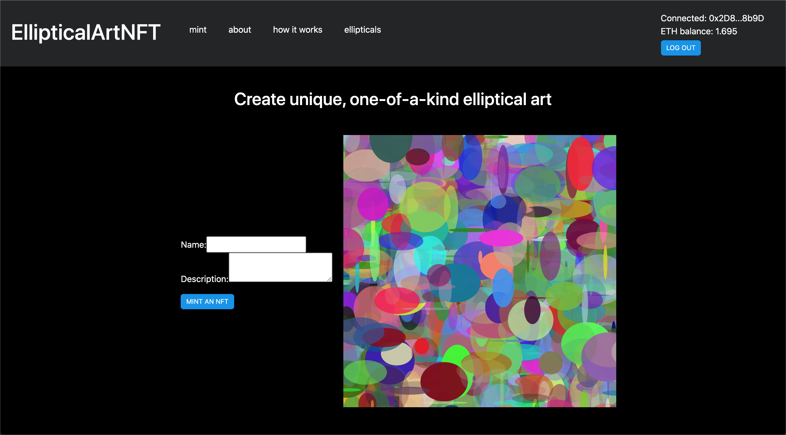
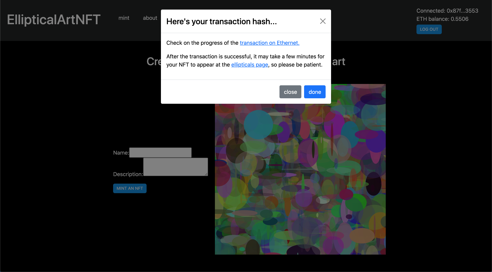
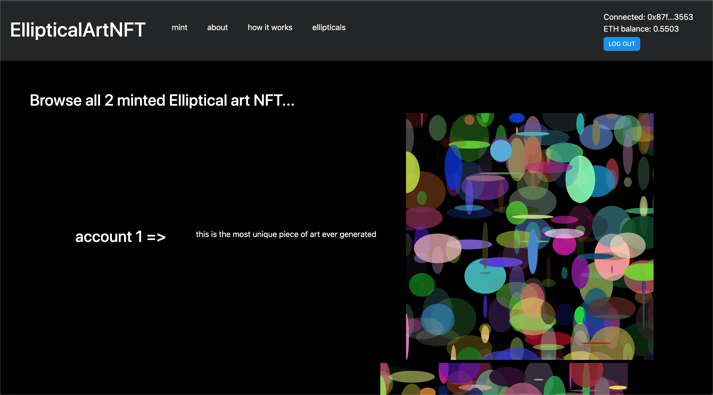
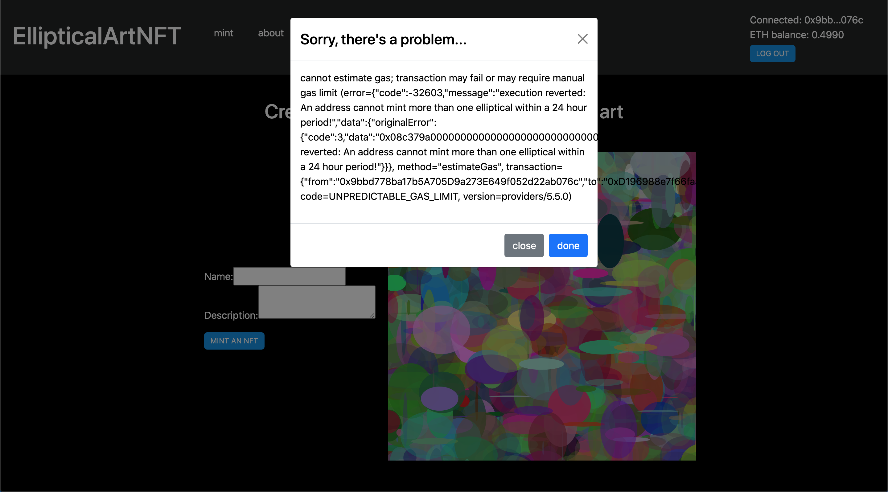
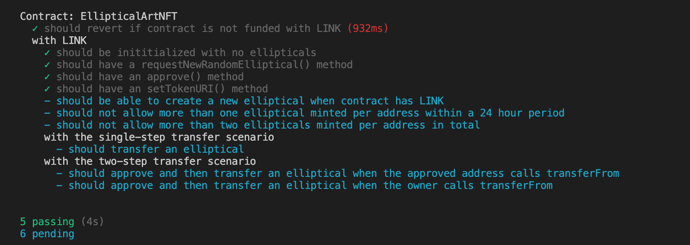

# EllipticalArtNFT

EllipticalArtNFT is a web3 app that allows users to mint ERC-721 non-fungible tokens (NFTs) that each represents ownership of a unique and limited piece of generative art created from randomly-generated elliptical shapes. 


Only 100 elliptical art NFTs can ever be minted, and each NFT is minted using "verifiable" randomness. Each wallet can mint only mint 1 elliptical art within a 24-hour period, and at most 2 ellliptical art NFTs.

## How EllipticalArtNFT Works

Whenever a user mints a new elliptical art NFT, the user will have to pay only the gas fee for the transaction. 

A smart contract, `EllipticalArtNFT`, is responsible for creating random attributes that are used to generate the elliptical shapes on the frontend.  To create a new ellptical NFT, the contract first makes a request for randomness to the [Chainlink Verifiable Random Function(VRF)](https://docs.chain.link/docs/chainlink-vrf/) using the `requestRandomness()` function inherited from the `VRFConsumerBase` contract. Then, whenever a provably random number is returned to the contract from the VRF Coordinator, the `fulfillRandomness()` function in the contract uses the number to create attributes for the elliptical art, which are stored on-chain, and finally the token is minted to the sender's address. One of the attributes is also generated using the [Chainlink `ETH-USD` price feed](https://data.chain.link/).

The frontend, using the [p5.js](https://p5js.org/) library, then uses these randomly-generated attributes to render the elliptical art in the browser. 

## Deployed Site URL

The frontend is deployed to Heroku, at [Heroku: Consensys Final Project](https://pacific-sea-29544.herokuapp.com).

## Screencast URL

[YouTube: Consensys Final Project](https://youtu.be/kcBCc3mdbPM)

## EllipticalArtNFT Contract Address

The `EllipticalArtNFT` contract is currently deployed to the Rinkeby testnet, at `0xD196988e7f66faa9838598385C3668e622179b7c`.

## Public Ethereum Address

`0x85ea1f1BD413b9fd797B9128e4AA6f81A5300701`

## How to Use EllipticalArtNFT to Mint an NFT 

1. On the `/home` page, press the `CONNECT TO WEB3` button to connect to the app via MetaMask. Make sure to use the Rinkeby network. After connecting to MetaMask successfully, the connected account address and balance will be displayed in the page header. A form titled `Create unique, one-of-a-kind elliptical art` will also appear on the page, as follows:



2. Enter a `name` and `description` for the elliptical art NFT you want to mint, then press the `MINT AN NFT` button. A MetaMask prompt will appear, asking you to confirm the gas fee for the transaction. Go ahead and press the `Confirm` button. 
   
3. It might take a few seconds for the transaction to be confirmed, so be patient. A modal will appear on the page, and it will give you a link to Ethernet so you can check on your transaction's progress.


  
4. It may take a few minutes for the newly minted elliptical art piece to show up at the `/ellipticals` page, so try refreshing the page occasionally. 



5. Keep in mind that each wallet can only mint 1 elliptical art NFT within a 24 hour period. If you try to mint another NFT with the same wallet address right now, you should see the following error:



## How to Store Elliptical Art Images and Metadata on `nft.storage` (Work in Progress)

Currently, the app does **not** store a copy of the generated art, but re-draws each elliptical art in the browser using randomly-generated attributes stored on-chain.

For more technical users, you could store the NFT metadata on `nft.storage`, which is a decentralized storage built on top of Filecoin/IPFS that makes it easier and cheaper to store images and metadata for NFTs. You can run the following scripts with the `truffle exec {path/to/script} --network rinkeby` command:

- `contracts/scripts/create-metadata.js`: creates the `.json` file containing the metadata for each elliptical art and stores the generated files at `contracts/metadata`
- `contracts/scripts/filecoin-deploy.js`: iterates through the `/metadata` folder, storing the contents of each `.json` file on `nft.storage`
- `contracts/scripts/set-token-uri.js`: sets the token URI of each elliptical art to an IPFS address that resolves to the elliptical art's metadata, including a link to the image

`contracts/scripts/generate-elliptical.js` creates new ellipticals, whereas `contracts/scripts/get-elliptical.js` retrieves an elliptical by its token id. These scripts are helpful for testing the smart contract without a frontend.

**NOTE** These scripts are still a work-in-progress, and you might run into issues when you try to run these scripts without tweaking them. 

As a next step for this project, additional UI elements and a simple RESTful API could be built out (possibly using the `json-server` library already configured in the project) to automatically handle these tasks.

## `EllipticalArtNFT` User Stories

- As a user, I want to login/connect to the app with my MetaMask wallet, so that I can mint elliptical NFTs as well as browse a list of all minted NFTs.
- As a user, I want to mint an elliptical art NFT, so that I can own a unique and beautiful piece of digital asset.
- As a user, I want to view a list of all minted elliptical art NFTs, so that I can enjoy viewing the NFTs minted by others.

## Installation

This project was bootstrapped with [Create React App](https://github.com/facebook/create-react-app).
### Prerequisites

- MetaMask Wallet 
- Git
- Node.js v.14+
- Truffle
- Ganache
- Yarn

### Running the project locally

First, fork and then clone the project locally.

In the project root, you can run `yarn install` to install the frontend and smart contract dependencies.

Then run `yarn start`, which concurrently runs the app in the development mode, starts a REST API at `http://localhost:3004` (not currently being used for anything), and connects the local app to the Rinkeby testnet.\

**NOTE** Setting up a local blockchain with Chainlink price feeds and VRF coordinator involves a non-trivial amount of research and effort, so this project opts to connect directly to Rinkeby for development purposes.   

Open [http://localhost:3000](http://localhost:3000) to view it in the browser.

The page will reload if you make edits.\
You will also see any lint errors in the console.

### CI/CD with Github Actions

Merging code into the `main` automatically kicks off the deployment to Heroku. The build and deploy steps are automated using Github Actions, and can be found in `./github/workflows`.

### Set up environment variables

Within the `contracts/` folder, create a new `.env` file containing the following information:

```
MNEMONIC=asdf asdf asdf...
RINKEBY_RPC_URL=asdf
NFTSTORAGE_API_KEY=asdf
```
You will need to replace the values above with your own custom values. `NFTSTORAGE_API_KEY` is optional to set, unless you would like to store NFT metadata on `nft.storage`.

### Running a local Ganache blockchain

- In your terminal, run `ganache-cli -p 7545` to start an Ethereum blockchain at port `7545`.

**NOTE: You can only run the following commands inside the `/contracts` folder:
- Run `truffle compile` to create the build artifacts directory, which contain the bytecodes version of the smart contracts, ABIs, etc.
- Run `truffle test` to execute the unit tests for the `EllipticalArtNFT` smart contract.
- Run `truffle migrate --reset --network rinkeby` to deploy the smart contracts to the Rinkeby network.

### Running tests

You can find the smart contract tests [here](/contracts/test/EllipticalArtNFT.js)

Unfortunately, there is a Solidity version conflict between the `EllipticalArtNFT` contract (which is written in Solidity 0.8.9) and the `@chainlink/contracts` (the project relies on `v0.6` of the `@chainlink/contracts`, which is written in Solidity ^0.6.0), so the tests won't run properly until you fix the pragma issues in the chainlink contracts.

 After installing the node dependencies with `yarn`, you'd have to go into the `node_modules` folder and update the pragma versions of the following contracts to `0.8.9`:

- `@chainlink/contracts/src/v0.6/tests/VRFCoordinatorMock`
  - Also remove the "public" keyword from the constructor method

- `@chainlink/contracts/src/v0.6/tests/MockV3Aggregator`
  - Also remove the "public" keyword from the constructor method
  
- `@chainlink/contracts/src/v0.6/interfaces/LinkTokenInterface`

- `@chainlink/contracts/src/v0.6/interfaces/AggregatorV2V3Interface`

- `@chainlink/contracts/src/v0.6/interfaces/AggregatorV3Interface`

- `@chainlink/contracts/src/v0.6/VRFConsumerBase`
  - Also remove the "public" keyword from the constructor method

- `@chainlink/contracts/src/v0.6/vendor/SafeMathChainlink`

- `@chainlink/contracts/src/v0.6/VRFRequestIDBase`

Within the `/contracts` folder, run `truffle test` to execute the tests.

If all goes well, you should see 5 passing tests, as follows:



Several tests are disabled for now, since the Chainlink mocks don't seem to be working properly. Testing Chainlink-powered smart contracts on rinkeby does not seem to be well-supported right now, and there's limited documentation on unit testing Chainlink-powered smart contracts with truffle. I would look into using hardhat instead in the future.

### Directory Structure

- `/.github/workflows`: contains the configuration files for building and deploying the app automatically
- `/contracts`
  - `/contracts`: contains smart contracts for the project written in Solidity
  - `/migrations`: contains the Truffle migration files that describe how to deploy the project's smart contracts
  - `/test`: contains the smart contract test code
  - `/truffle-config.js`: configuration and settings file for smart contract development and deployment
  - `/scripts`: contains scripts for interacting with the smart contract
- `/src`
  - `/abis`: stores any contract ABIs that the frontend uses to interact with the smart contract
  - `/api`
    - `client.js`: a client wrapper around the Fetch API that supports `GET`, `POST`, `PUT`, and `DELETE` requests
  - `/app`: contains the top-level component for the application
    - `/layout`: contains the layout components, including the footer, header, navigation etc.
      - `index.js`: defines and exports the `Layout` component, which contains the routing for the application
    - `index.js`: exports the `App` component, which can render different layouts
    - `store.js`: configures and exports the Redux store
  - `/common`: contains code used across components annd throughout the application
    - `/constants`: contains shared constants (e.g., `STATUS.idle`)
    - `/core`: contains generic components (e.g., `Button`, `Modal`, `Loader`, etc.)
    - `/utils`: contains utility functions (e.g., `formatNumber()`)
    - `/hooks`: contains reusable hook logic, such as `useEth()`, `useContract()`, etc.
  - `/features`: contains the code for the main features of the application
    - `/auth`: components for authenticating the user and connecting to MetaMask
    - `/ellipticals`: components for minting and displaying elliptical NFTs
    - `index.js`: exports the components from the `/features` folder
  - `/pages`: components that represent different pages of the applicadtion
  - `/styles`
    - `global.css`: contains global css styles used throughout the application
  - `index.js`: entry point to the React Application
  - `setupTests.js`: import any additional libraries used to extend test functionality (e.g, `jest-dom`)
- `.gitignore`: specifies the files to ignore when committing the project to Github
- `avoiding_common_attacks.md`: describes common attack vectors and their SWC numbers that the smart contract protects against
- `db.json`: JSON database for your fake REST API (not used in the project currently)
- `deployed_address.txt`: contains information on the testnet address and the network the smart contract was deployed to
- `design_pattern_decisions.md`: describes the design pattern decisions used to build the smart contract
- `package.json`: manifest file for the project
- `Procfile`: a file containing commands to be run by the app's dynos after it is deployed to Heroku  
- `routes.json`: routing logic for your fake REST API
- `server.js`: the server setup script that the app's dynos will run after the app is deployed to Heroku

The following principles were applied in the design of the folder structure:

- A consistent and predictable naming convention makes it relatively easy to locate needed files and understand where new files should be created. Each feature contains sub-folders that represent a CRUD operation for that feature (e.g., `/create`, `/edit`).

- All files related to a component (e.g., component, test, and css files) are kept together under a single folder so it's easy to find and update the code for a given feature.

- The service abstracts away the API logic for each feature, thereby avoiding the need to hard-code the API calls into the components directly.

- Core UI components such as Button, Form, List, etc. are kept in a separate directory (i.e., `src/common/core`). As the UI library continues to grow, the core UI library could be packaged for use in another project or published as part of Storybook. Some developers on the team can even focus on this directory only.

## Next Steps

- Use Chainlink keepers and external adapters to make the elliptical art NFTs truly dynamic that evolve with provably random attributes that change over
- Set up Chainlink nodes on a local blockchain for development. The majority of the tests are not working because testing Chainlink-powered smart contracts on rinkeby does not seem to be well-supported right now, and there's limited documentation on unit testing Chainlink-powered smart contracts with truffle. Hardhat seems to offer better support, so I might look into this option in the future. 
- Build out a form that allows the user to submit the elliptical art image to be stored on Filecoin
- Build out a basic backend (possibly using the `json-server` library already configured in the project) that can automatically handle the tasks in `./contracts/scripts` via a RESTful interface, such as creating the metadata for each NFT, setting the tokenURI for each NFT, and deploying the metadata automatically to nft.storage

## Other Available Scripts

### `yarn build`

Builds the app for production to the `build` folder.\
It correctly bundles React in production mode and optimizes the build for the best performance.

The build is minified and the filenames include the hashes.\
Your app is ready to be deployed!

See the section about [deployment](https://facebook.github.io/create-react-app/docs/deployment) for more information.

### `yarn eject`

**Note: this is a one-way operation. Once you `eject`, you can’t go back!**

If you aren’t satisfied with the build tool and configuration choices, you can `eject` at any time. This command will remove the single build dependency from your project.

Instead, it will copy all the configuration files and the transitive dependencies (webpack, Babel, ESLint, etc) right into your project so you have full control over them. All of the commands except `eject` will still work, but they will point to the copied scripts so you can tweak them. At this point you’re on your own.

You don’t have to ever use `eject`. The curated feature set is suitable for small and middle deployments, and you shouldn’t feel obligated to use this feature. However we understand that this tool wouldn’t be useful if you couldn’t customize it when you are ready for it.

## Learn More

You can learn more in the [Create React App documentation](https://facebook.github.io/create-react-app/docs/getting-started).

To learn React, check out the [React documentation](https://reactjs.org/).

### Code Splitting

This section has moved here: [https://facebook.github.io/create-react-app/docs/code-splitting](https://facebook.github.io/create-react-app/docs/code-splitting)

### Analyzing the Bundle Size

This section has moved here: [https://facebook.github.io/create-react-app/docs/analyzing-the-bundle-size](https://facebook.github.io/create-react-app/docs/analyzing-the-bundle-size)

### Making a Progressive Web App

This section has moved here: [https://facebook.github.io/create-react-app/docs/making-a-progressive-web-app](https://facebook.github.io/create-react-app/docs/making-a-progressive-web-app)

### Advanced Configuration

This section has moved here: [https://facebook.github.io/create-react-app/docs/advanced-configuration](https://facebook.github.io/create-react-app/docs/advanced-configuration)

### Deployment

This section has moved here: [https://facebook.github.io/create-react-app/docs/deployment](https://facebook.github.io/create-react-app/docs/deployment)

### `yarn build` fails to minify

This section has moved here: [https://facebook.github.io/create-react-app/docs/troubleshooting#npm-run-build-fails-to-minify](https://facebook.github.io/create-react-app/docs/troubleshooting#npm-run-build-fails-to-minify)
